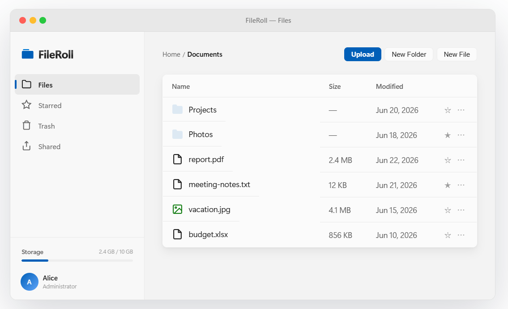

# FileRoll

[English](../README.md) · [中文](./README.zh.md) · [日本語](./README.ja.md) · Español

FileRoll es una aplicación de almacenamiento en la nube personal con soporte WebDAV que ofrece gestión de archivos, control de versiones, compartición, gestión multiusuario y más. Construida con PHP 8+ y SQLite/MySQL, se puede acceder mediante un navegador o cualquier cliente WebDAV.



## Características

- **Gestión de archivos y carpetas**: subida arrastrar y soltar, mover, copiar, renombrar, papelera, favoritos
- **Control de versiones**: guardar y restaurar con un clic el historial de versiones de archivos
- **Compartición**: generar enlaces públicos / protegidos con contraseña / con límite de tiempo
- **Multiusuario y permisos**: los administradores pueden gestionar usuarios, cuotas y roles
- **Soporte WebDAV**: compatible con el Explorador de Windows, Finder de macOS, Cyberduck, RaiDrive y otros clientes
- **Endurecimiento de seguridad**: hash de contraseñas bcrypt, protección CSRF, protección contra path traversal, filtrado XSS, limitación de tasa
- **Internacionalización**: admite 8 idiomas en la interfaz
- **Gestión mediante CLI**: comandos integrados para migraciones, creación de usuarios, restablecimiento de contraseñas, tareas de limpieza, etc.

## Stack tecnológico

- PHP 8.0+
- SQLite / MySQL / MariaDB
- Gestión de dependencias con Composer
- Autocarga PSR-4, arquitectura MVC
- Despliegue en nginx / Apache

## Inicio rápido

### Requisitos

| Elemento | Requisito |
|---|---|
| PHP | >= 8.0 |
| Extensiones | PDO, pdo_sqlite/pdo_mysql, json, mbstring, session, ctype, filter, fileinfo, gd |
| Servidor web | nginx o Apache (mod_rewrite) |
| Base de datos | SQLite (predeterminado) o MySQL 5.7+ / MariaDB 10.3+ |

### Despliegue en un minuto

```bash
git clone <url-del-repositorio> fileroll
cd fileroll
composer install --no-dev
mkdir -p storage/content storage/temp storage/trash
chmod -R 775 storage/ config/
```

Luego configura tu servidor web para que apunte a `public/` (recomendado) o a la raíz del proyecto (enfoque LNMP), y visita el dominio para entrar en el asistente de instalación.

> **Instrucciones de despliegue detalladas** (incluyendo configuraciones completas de nginx/Apache, paquete LNMP, permisos, FAQ) están en [DEPLOYMENT.es.md](./DEPLOYMENT.es.md).

### Asistente de instalación

Visita `https://yourdomain.com/` en tu navegador y sigue los pasos guiados:

1. Comprobación del entorno
2. Configuración de la base de datos (SQLite o MySQL)
3. Creación de la cuenta de administrador
4. Finalizar instalación

Después de la instalación, se recomienda eliminar el directorio `install/`:

```bash
rm -rf install/
```

## Estructura de directorios

```
├── public/              # Punto de entrada web (DocumentRoot debe apuntar aquí en despliegue estándar)
│   ├── index.php
│   └── assets/
├── config/              # Configuración (config.php se genera en la instalación, no va en Git)
├── src/                 # Código fuente PHP (PSR-4: FileRoll\\)
├── templates/           # Plantillas de vistas
├── storage/             # Archivos subidos, temporales, papelera, base de datos, registros
├── install/             # Asistente de instalación web (eliminar tras la instalación)
├── vendor/              # Dependencias de Composer
├── lang/                # Archivos de internacionalización
├── tests/               # Tests de PHPUnit
├── scripts/console.php  # Script de gestión CLI
└── DEPLOYMENT.md        # Guía de despliegue detallada
```

## Gestión mediante CLI

```bash
php scripts/console.php migrate          # Ejecutar migraciones de base de datos
php scripts/console.php create-user      # Crear usuario
php scripts/console.php reset-password   # Restablecer contraseña
php scripts/console.php storage-stats    # Estadísticas de almacenamiento
php scripts/console.php cleanup-sessions # Limpiar sesiones expiradas
```

## Uso de WebDAV

FileRoll proporciona un endpoint WebDAV estándar:

```
https://yourdomain.com/dav
```

Tras iniciar sesión con Basic Auth, puedes gestionar los archivos en la nube como si fueran un disco local. Admite subida de archivos grandes por chunks y protocolos de sincronización parcial compatibles con clientes Nextcloud/ownCloud.

## Notas de seguridad

- Las contraseñas se almacenan con bcrypt (cost=12)
- Todos los envíos de formularios validan el token CSRF
- Los archivos se almacenan por hash de contenido para evitar duplicados y permitir revertir versiones
- Los nombres de archivo y rutas subidos se desinfectan estrictamente para prevenir path traversal
- Las subidas WebDAV solo pueden realizarlas los usuarios autenticados; se prohíbe el acceso entre usuarios
- El plugin HTML del navegador WebDAV y los registros de depuración están deshabilitados por defecto en producción
- El historial detallado de correcciones de seguridad está en el historial de commits y en el capítulo de configuración del servidor de [DEPLOYMENT.es.md](./DEPLOYMENT.es.md)

## Configuración

Toda la configuración se centraliza en `config/config.php`, generado por el asistente de instalación. Elementos clave:

```php
'app' => [
    'url' => 'https://fileroll.yourdomain.com',
    'debug' => false,          // Desactivar obligatoriamente en producción
],
'session' => [
    'cookie_params' => [
        'secure' => true,      // Habilitar en entorno HTTPS
        'httponly' => true,
        'samesite' => 'Lax',
    ],
],
```

Para más opciones de configuración, consulta `config/config.sample.php`.

## Ejecutar tests

```bash
composer install          # Instalar dependencias de desarrollo
vendor/bin/phpunit        # Ejecutar todos los tests
```

## Licencia

MIT License
